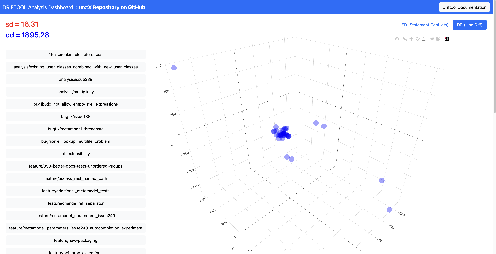

# driftool :: Git Branch Inconsistency Analysis

**🚑 Under active development, features may change unexpectedly!**

---

The driftool calculates the drift analysis for git repositories. 
It automatically compares all branches, simulates merges and generates both a scalar drift metric, as well as a 3D view of the repository drift.
The pairwise distance is the number of lines of merge conflicts.
The base measure of the point-cloud is the *mean absolute deviation around a central point*.

The results of driftool indicate how well or poorly a repository is managed. 
High drift indicates large inconsistencies in between branches. 
The drift is an absolute metric that always has to be interpreted in the context of the repository size. 
A repository with dozens of collaborateurs and branches naturally has more drift as a project with 3 developers working on. 
However, the evolution of the drift over time gives useful insigts about the project health.

## Key Metrics

The driftool calculates the *Drift* measure **sd** (gamma).

* **sd** is the *Statement Drift* := a measure for the merge complexity based on the pair-wise git merge conflict count as a distance

In general, higher numbers indicate a more complex repository management.

:bulb: Per default, a git merge is a symmetric operation, meaning A into B produces the same conflicts as B into A. However, through certain git operations (resets, force operations, messed-up history) it happens that the merge is not symmatric. For example, A into B has 2 conflicing lines, although B into A has 4 conflicting lines. To cope with that, the driftool performs each merge both ways and takes the AVG of conflicts.

## Report Generation

The driftool generates HTML reports for further human analysis. 
The following figure shows such an analysis. 
The right side list displays all analysed branches. 

The scatterplot uses a synthetic coordinate system resulting from multidimensional scaling of the pairwise distances. 
However, point distribution is helpful for repository analysis. 
Evenly scattered points indicate many unrelated but conflicting changes. 
Clusters indicate groups of very compatible branches. 
Outliers indicate standalone branches with lots of inconsistencies compared to the majority.

# Getting Started

To get started with the driftool, please read the [configuration instructions](./doc/Configuration.md) first.

You can run the driftool in a local setup or via docker. If your primary goal is to run a driftool analysis on your repository, we recommend the [driftool docker setup](./doc/DockerSetup.md). With that, you only need docker on your system and no additional dependencies. Notably, running driftool via our docker image might lead to significantly faster execution times compared to a local environment.

If you want to contribute to the driftool or do not want a docker installation, you can start the driftool directly on your system by following the [driftool developer setup](./doc/DeveloperSetup.md)

---

This repository is part of a research project of the [*Software Technology Group*](https://tu-dresden.de/ing/informatik/smt/st?set_language=en) at *Dresden University of Technology*.
Contact Karl Kegel (KKegel) for further information. 
