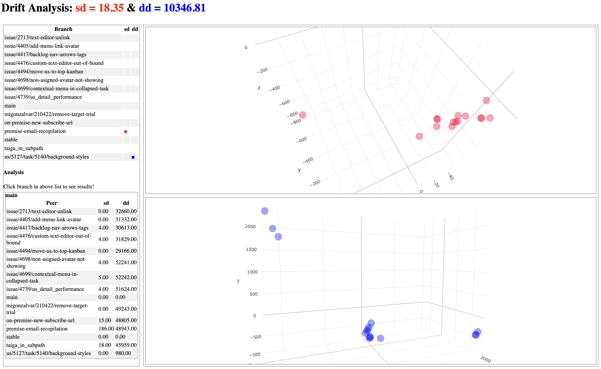

# driftool :: Git Branch-Variance Analysis

The driftool calculates the drift analysis for git repositories. It automatically compares all branches, simulates merges and generates both a scalar drift metric, as well as a 3D view of the repository drift.
The base measure is the standard deviation of diffs and merge conflicts in between branches.

The results of driftool indicate how well or poorly a repository is managed. High drift indicates large differences between branches. The drift is an absolute metric that always must stand in the context of the repository size. A repository with dozens of collaborateurs and branches naturally has more drift as a project with 3 developers working on. However, the evolution of the drift over time gives useful insigts about the project health.

## Key Metrics

The driftool calculates the *Drift* for two difference measures.

* **sd** is the *Statement Drift* := the standard deviation of conflicting lines during merge
* **dd** is the *Difference Drift* := the standard deviation of the size of the git diff

In general, higher numbers indicate a more complex repository management.

:bulb: Per default, a git merge is a symmetric operation, meaning A into B produces the same conflicts as B into A. However, through certain git operations (resets, gitignore change etc.) it happens that the merge is not symmatric. For example, A into B has 2 conflicts, although B into A has 0 conflicts. To cope with that, (the current version of) driftool performs each merge both ways and takes the AVG of conflicts.

## Report Generation

The driftool generates HTML reports for further human analysis. The following figure shows such an analysis. The right side list displays all analysed branches. The top-right graph shows the drift based on (merge-)conflicting lines. The bottom-right graph shows the drift based on pure differences. Both graphs are interactive 3D visualizations.



The scatterplots use a synthetic coordinate system resulting from multidimensional scaling of the pairwise distance measures. However, Point distribution is helpful for repository analysis. Evenly scattered points indicate many unrelated but conflicting changes. Clusters indicate groups of very compatible branches. Outliers indicate standalone branches with lots of differences compared to the majority.

## Usage

The driftool is a python application. To run it, it requires:
- python 3.12.0 (other versions might work but are not tested)
- pip
- git installation (accessible via PATH) 

It is preferred to use the existing ``requirements.txt`` to create a virtualenv.
Please see the official [virtualenv documentation](https://packaging.python.org/en/latest/guides/installing-using-pip-and-virtual-environments/#install-packages-in-a-virtual-environment-using-pip-and-venv).

> :bulb: Note that for large repositories, the drift calculation can take some time. The number of comparison rounds grows ``0.5 * (number of branches)^2``. Each comparison round is linearly dependent on the repository size.

> :bulb: Driftool is not sufficiently tested on Windows. A known Windows issue is the possible inability to delete temporary files due to the git file lock. After using the driftool on Windows, please remove the ./tmp folder in the working directory manually.

For large (memory instensive) repositories, we recommend running the driftool from a RAM-Disk on a Linux system. This reduced the IO load significantly!

### CLI

1. If installed, activate the venv and make sure all requirements are installed
2. Run ```python main.py ...args``` with the desired arguments or with an configuration file only.
3. After completion, the drift metrics are printed to stdout, if specified, report files and graph views are generated.

All processing steps are performed on a temporary local copy of the git repository. The orignal repository is not touched.

#### Arguments

* ``-c`` | ``--config`` STRING (optional) path to a config json file (see *Config* section below). If defined, all other CLI arguments are ingored and the config values are used instead.
* ``-i`` | ``--input_repository=`` STRING absolute path to the input repository.
* ``-o`` | ``--output_directory=`` STRING (optional) exports the analysis to a json file to the specified directory.
* ``-f`` | ``--fetch_updates``BOOLEAN (optional) pulls each branch of the (local tmp) repository before analysis starts.
* ``-p`` | ``--print_plot`` BOOLEAN (optional) shows a pyplot of the results after finishing the calculation.
* ``-t`` | ``--html`` BOOLEAN (optional) generates a static HTML page with interactive in-depth result analysis. Requires the ``output_directory`` to be set.
* ``-s`` | ``--show_html`` BOOLEAN (optional) automatically opens the HTML analysis in the default browser after completing the calculation. Requires ``html`` to be enabled.
* ``-b`` | ``--branch_ignore=`` STRING (optional) a list of regualar expressions (python style). Branch names matching at least one of the expressions are ignored. For example, ignore numbered release branches. The regexs must be concatenated to a single string seperated by ``::``. :ambulance: Not fully supported yet!
* ``-g`` | ``--file_ignore=`` BOOLEAN (optional) files to be ignored during comparison given as .gitignore entries seperated by ``::``. Binaries or large autogenerated files should be ignored during analysis, e.g., ``*.pdf``, ``package-lock.json`` or ``gradle-wrapper/``. :ambulance: Not supported yet!
* ``-x`` | ``--open_socket=`` INT (optional) opens an (unsecured) websocket server on the given port that forwards the analysis progress to each consumer. :ambulance: Not supported yet!

> :bulb: On Windows, use the driftool only via the Powershell and use Unix-style path encodings.

**Example**

```
python main.py -i "/Users/.../foo" -o "./" -t true -s true
```

Analyze the *foo* repository. The results are written to the working directory. HTML is generated and the resulting HTML analysis is shown in the browser.

#### Config

Instead of passing the arguments via the CLI, a config .json file can be specified instead. It must adhere to the following template.

> :zap: Experimental feature, not tested in-depth.

```JSON
{
    "input_repository": "STRING",
    "output_directory": "STRING | undefined",
    "fetch_updates": "BOOLEAN",
    "print_plot": "BOOLEAN",
    "html": "BOOLEAN",
    "show_html": "BOOLEAN",
    "branch_ignore": [
        "STRING"
    ],
    "file_ignore": [
        "STRING"
    ],
    "open_socket": "STRING"
}
```

**Example**

The following example is provided as ``config.template.json`` as part of this repository.

```JSON
{
    "input_repository": "/home/user/repository/",
    "output_directory": "./",
    "fetch_updates": false,
    "print_plot": false,
    "html": true,
    "show_html": true,
    "branch_ignore": [
        "^release\\-",
        "^v\\."
    ],
    "file_ignore": [
        "build/",
        "dist/",
        "gen/",
        "*.min.js",
        "*.lib.js",
        "node-modules/",
        "*.pdf",
        "javadoc/"
    ]
}
```

---

This repository is part of a research project of the [*Software Technology Group*](https://tu-dresden.de/ing/informatik/smt/st?set_language=en) at *Dresden University of Technology*.
Contact Karl Kegel (KKegel) for further information. 